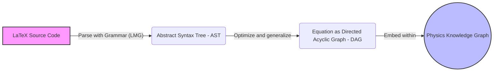
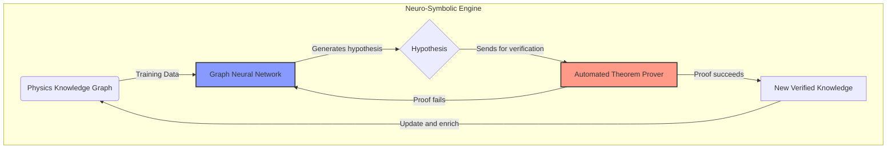
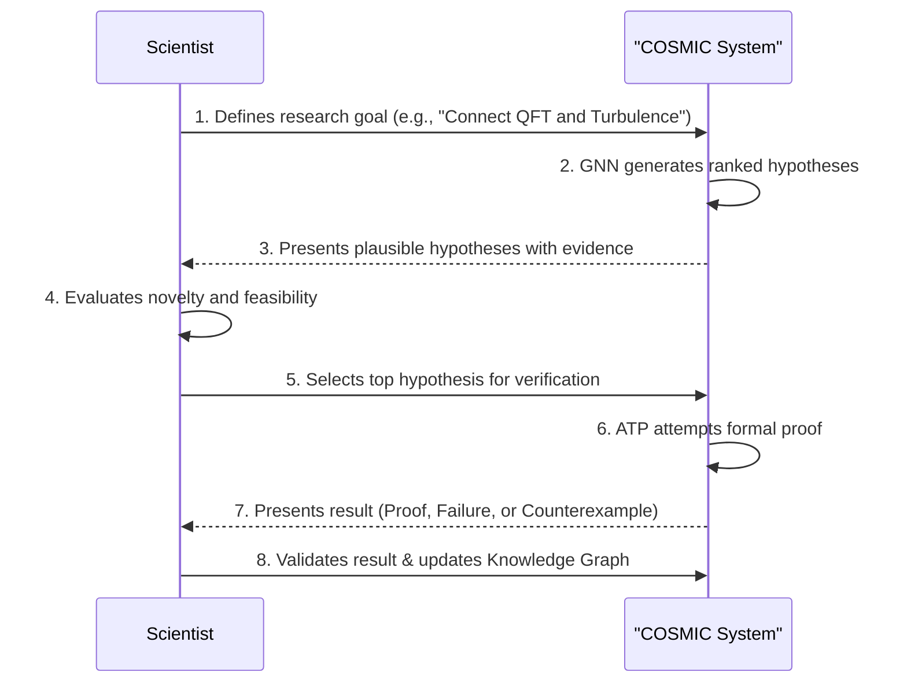
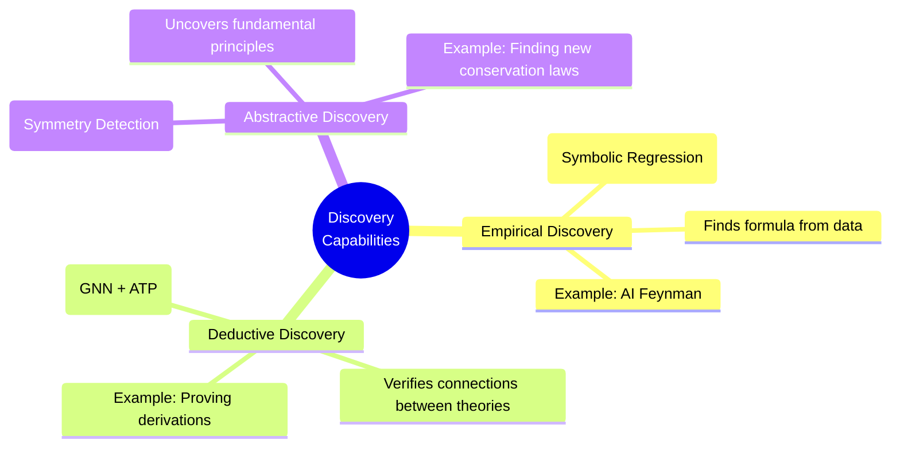
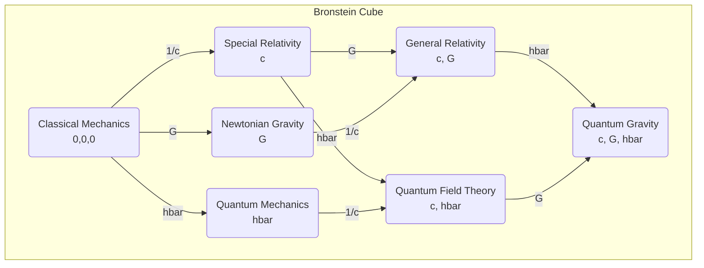

# **COSMIC: Constant Observation and Search for Mathematical Interconnections in Cosmology**

## **1\. Abstract**

**COSMIC** is a research project and software implementation dedicated to exploring the frontiers of AI-driven scientific discovery. It moves beyond traditional statistical models to build a system capable of understanding and reasoning about the fundamental structure of mathematics and physics.

This repository contains the initial proof-of-concept script, symbolic\_discovery.py, which uses symbolic computation to find, verify, and simulate the discovery of connections between formulae and fundamental constants. This work serves as the foundational layer for a more ambitious neuro-symbolic discovery engine, as detailed in our [Architectural Blueprint](https://www.google.com/search?q=%23LINK_TO_PAPER_OR_DOC).

## **2\. Motivation**

Contemporary Large Language Models (LLMs) excel at processing natural language but are fundamentally limited by their statistical nature. They lack the logical rigor and structural understanding required for formal scientific reasoning, making them prone to "hallucinations" and unable to handle formal systems reliably.

COSMIC is founded on a different paradigm: a **neuro-symbolic architecture**. The goal is to create an "AI co-scientist" that combines the pattern-recognition strengths of neural networks (like Graph Neural Networks) with the logical precision of symbolic systems (like computer algebra systems and theorem provers).

This approach allows the AI to:

* **Represent knowledge structurally** as a graph of interconnected concepts and equations.  
* **Reason about the underlying logic** of formulae, not just their textual appearance.  
* **Generate verifiable hypotheses** that can be formally proven or disproven.  
* **Discover deep analogies** and hidden symmetries between different physical domains.

Here are several Mermaid diagrams that visualize the key concepts, workflows, and architectures described in the COSMIC project blueprint.

### 1. Knowledge Representation Pipeline

This flowchart illustrates the multi-stage process of converting human-readable scientific notation into a machine-reasoning-ready format, as detailed in **Part I** of the blueprint. It shows the progression from semantically poor text to a rich, structured graph.

2. The Neuro-Symbolic Feedback Loop

This diagram shows the core reasoning engine from Part II. It highlights the symbiotic, self-improving cycle where the neural component generates hypotheses and the symbolic component verifies them, with the results feeding back to improve the entire system.

3. The Human-in-the-Loop Discovery Cycle

This sequence diagram models the collaborative workflow between a human researcher and the AI system, as described in Part IV. It shows how human expertise guides the AI's powerful search and verification capabilities.

4. Hierarchy of Discovery Methods

This mindmap visualizes the three distinct levels of scientific discovery the system is designed to tackle, as outlined in Part III. It progresses from data-driven empirical discovery to the uncovering of abstract, fundamental principles.

5. The Bronstein Cube of Theories

This diagram illustrates the conceptual framework from Part V, showing how fundamental constants (G,c,hbar) define the landscape of major physical theories. It visualizes the relationships between different domains of physics.

## **3\. The symbolic\_discovery.py Script**

This repository contains the first implementation of this vision. The script is a self-contained demonstration of the core symbolic reasoning capabilities.

### **Features & Examples**

The script is divided into several parts, each demonstrating a key discovery methodology:

* **Part 2: Mathematical Derivation:** Verifies a known connection by logically deriving the definition of cos(x) from Euler's formula.  
* **Part 3: Physics Derivation:** Shows a derivational path from Newton's Second Law (F=ma) and the definition of Work to the formula for Kinetic Energy (K \= 1/2 \* m \* v\*\*2).  
* **Part 4: Structural Analogy:** Identifies the deep physical analogy between a mechanical mass-spring system and an electrical LC circuit by showing their governing differential equations share the exact same mathematical structure.  
* **Part** 5: Connections Between **Constants:** Analyzes how a dimensionless value like the fine-structure constant (alpha) is not an independent number but a composite of other fundamental constants from electromagnetism, relativity, and quantum mechanics.  
* **Part 6: Simulating Novel Discovery:** Provides a conceptual simulation of how an AI might search for a *previously unknown* relationship. It uses a brute-force symbolic regression approach to find the hidden formula (TARGET ≈ C3\*\*2) relating a set of numerical constants.

## **4\. Getting Started**

### **Prerequisites**

* Python 3.x  
* SymPy library

### **Installation**

Install the required SymPy library using pip:

pip install sympy

### **Usage**

To run the demonstration, simply execute the Python script from your terminal:

python symbolic\_discovery.py

The script will print the output of each demonstration part to the console, showing the axioms, derivation steps, and conclusions.

## **5\. Future Vision**

This script represents the "symbolic" component of our proposed neuro-symbolic architecture. The long-term vision for the COSMIC project is to build a complete discovery engine by:

1. **Building a Physics Knowledge Graph:** Encoding a vast network of theories, formulae, and concepts into a graph structure.  
2. **Developing a Graph Neural Network (GNN):** Training a GNN on this graph to learn the "language" of physics and generate novel hypotheses via link prediction and analogy detection.  
3. **Integrating an Automated Theorem Prover (ATP):** Using the GNN as a powerful heuristic to guide the ATP in formally verifying the generated hypotheses.  
4. **Creating a Human-in-the-Loop Workflow:** Building an interactive system where a human researcher can guide the AI's discovery process and validate its findings.

This project aims to create a trustworthy and verifiable AI partner to help accelerate the pace of fundamental scientific discovery.

## **6\. License**

This project is licensed under the MIT License. See the [LICENSE](https://www.google.com/search?q=LICENSE) file for details.
